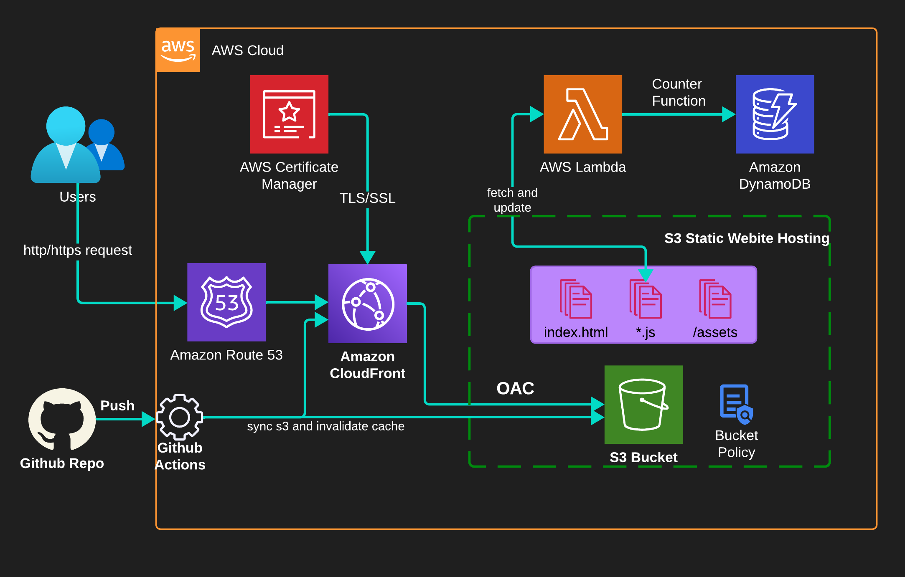

# Cloud Resume Challenge Project

- [Cloud Resume Challenge Project](#cloud-resume-challenge-project)
  * [Challenges](#challenges)
  * [Preparation](#preparation)
  * [Chapter 1: Create a resume website with AWS Management Console](#chapter-1-create-a-project-with-aws-management-console)
  * [Chapter 2: Will be soon ...](#chapter-2-enhance-resume-cloud-project-using-infrastructure-as-code-will-be-soon)
  


This Challenge came Up with [Forrest Brazeal](https://forrestbrazeal.com/2020/04/23/the-cloud-resume-challenge/) 

At this project, we'll tackle all of these [Cloud Challenge](https://cloudresumechallenge.dev/docs/the-challenge/aws/) (`all conditions are clickable`).

 *In this project, I will attempt to describe how to create a static S3 website for your resume, dividing it into two (maybe 4) Chapters:*

    - Chapter 1: Create a project with AWS Management Console 
    - Chapter 2: Define all project resource in an AWS SAM (IaC) - (Will be soon...)
    - Chapter 3: Terraform as IaC
    - Chapter n: Improving (API Gateway, ALB, monitoring, HA, CloudWatch event bus-> Lambda -> SNS Later...)

> Our cloud resume project diagramm



## Challenges

1. [**Resume Format**](#resume-html5-and-css-format): Your resume should be in HTML format, not a Word document or PDF. Here's an example of the desired format.

2. **Styling**: Use CSS to style your HTML resume. It doesn't need to be overly fancy, but it should look more than just plain HTML.

3. **Deployment**: Host your HTML resume as an Amazon S3 static website. While services like Netlify and GitHub Pages are excellent for personal static site deployments, we prefer using S3 for this project.

4. **Security**: Ensure that the S3 website URL uses HTTPS for security. You'll need to utilize Amazon CloudFront for this.

5. **Custom Domain**: Point a custom DNS domain name to the CloudFront distribution, allowing access to your resume via a personalized domain (e.g., my-c00l-resume-website.com). You can use Amazon Route 53 or another DNS provider for this, usually costing about ten dollars to register.

6. **Visitor Counter**: Your resume webpage should feature a visitor counter displaying the number of site visitors. Implement this using JavaScript. Here's a helpful tutorial to get you started.

7. **Database**: Set up a visitor counter that retrieves and updates its count in a database. We recommend using Amazon's DynamoDB for this purpose. DynamoDB's on-demand pricing is cost-effective unless you need excessive data storage or retrieval. You can find a free course on DynamoDB here.

8. **API Development**: Create an API to interact with DynamoDB instead of direct communication from your JavaScript code. We suggest using AWS's API Gateway and Lambda services. Python, with the boto3 library for AWS, is a suitable choice for back-end programming. You can find a free Python tutorial here.

9. **Testing**: Include tests for your Python code. Here are some resources for writing effective Python tests.

10. **Infrastructure as Code**: Define your API resources (DynamoDB table, API Gateway, Lambda function) in an AWS Serverless Application Model (SAM) template and deploy them using the AWS SAM CLI. This approach, known as "infrastructure as code," saves time in the long run.

11. **Continuous Integration and Deployment (CI/CD)**: Set up a private GitHub repository for your back-end code and configure GitHub Actions. When you push updates to your SAM template or Python code, automated testing should occur. If the tests pass, the SAM application should get packaged and deployed to AWS.

12. **Website Updates**: Create a second private GitHub repository for your website code. Configure GitHub Actions so that when you push new website code, the S3 bucket automatically updates. Be cautious not to expose AWS credentials in your source control.

13. **Blog Post**: Include a link in your resume to a brief blog post describing what you learned during this project. Dev.to is a great platform for publishing if you don't have your blog.

14. **Completion**: Once you've completed all these steps, add my GitHub username (@forrestbrazeal) as a collaborator on your repositories. If you meet the conditions mentioned above, I'll provide a personalized code review and help promote your work.

## Preparation

*For training we try to use git flow branching without dev env (master branch with features branching)*

1. You need to have `AWS` and `Github` accounts or create them [github](https://github.com) code repo for our project, [AWS registration](https://portal.aws.amazon.com/gp/aws/developer/registration/index.html?nc2=h_ct&src=header_signup)

2. I'm using [`gitpod`](https://www.gitpod.io/) CDEs - pre-configured with your tools and dependencies for writing, testing and reviewing code.

* Run your project repo on IDE environment

* Create `gitpod.yml` in the root project directory

3. For reviewing our website install on `gitpod` or your IDE [http-server](https://marketplace.visualstudio.com/items?itemName=ritwickdey.LiveServer)

4. Install AWS CLI 

```sh
  cd $THEIA_WORKSPACE_ROOT
  curl "https://awscli.amazonaws.com/awscli-exe-linux-x86_64.zip" -o "awscliv2.zip"
  unzip awscliv2.zip
  sudo ./aws/install
```

> To automate our gitpod environment add next to `gitpod.yml`

```yml
tasks:
  - name: aws-cli
    env:
      AWS_CLI_AUTO_PROMPT: on-partial
    before: |
      cd $THEIA_WORKSPACE_ROOT
      curl "https://awscli.amazonaws.com/awscli-exe-linux-x86_64.zip" -o "awscliv2.zip"
      unzip awscliv2.zip
      sudo ./aws/install
      rm -Rf aws*
# aws cli for macos
      #curl "https://awscli.amazonaws.com/AWSCLIV2.pkg" -o "AWSCLIV2.pkg"
      #sudo installer -pkg AWSCLIV2.pkg -target /
vscode:
  extensions:
    - amazonwebservices.aws-toolkit-vscode
```
5. Download Website Template into the repo 

For my website I personally used [HTML5 UP](https://html5up.net/) template.

* Download template from [This site](https://html5up.net/).

* Build your website using some IDE

6. When finished we'll explain how to download your website template to AWS s3 bucket

* Zip the project code of your website for use in `AWS S3`.

> Completed Web Project [thevopz.com](https://thevopz.com)


`Are you interested in this? :) Let's get down to writing your cloud resume.`

### [Chapter 1: Create a resume website with AWS Management Console](info/chapter_1.md)

### [Chapter 2: Enhance Resume Cloud Project Using Infrastructure as Code (Will be soon ...)](info/chapter_2.md)