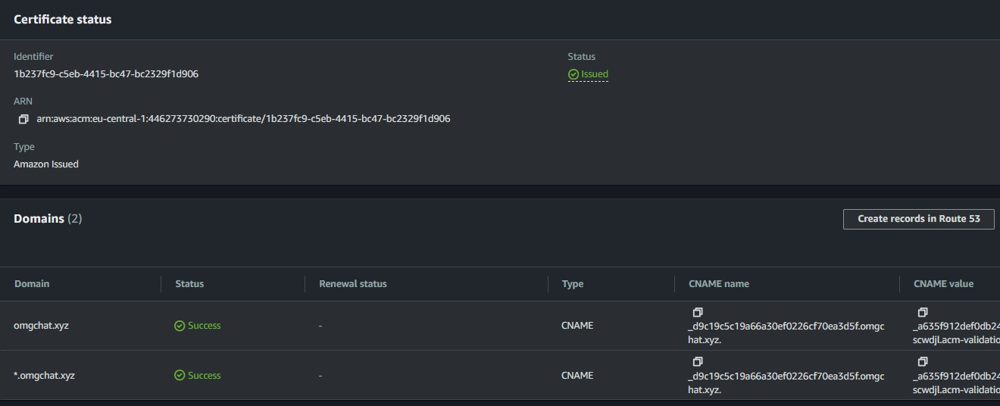
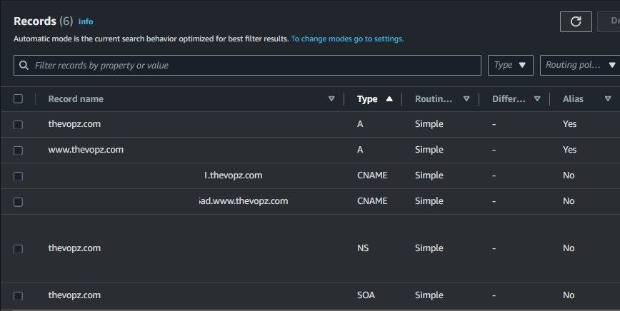

# Chapter 1: Create a project with AWS Management Console

## Step 1: Domain Configuration and SSL Certificates

The organization that governs domain names is called the Internet Corporation for Assigned Names and Numbers (ICANN) 
and it has made it impossible for anyone to acquire a domain name forever.

* Buy domain name with `AWS Route 53` service or another `Registrars` for example, the best in my opinion [Porkbun](https://porkbun.com)

> Create Route 53 `hosted zone`

> If you bought domain name not from AWS you'll need to reconfigure `AUTHORITATIVE NAMESERVERS` 

* Copy from created `hosted zone` your four `NS` records 

* Configure and Paste to your domain name registrar DNS records

> example for `porkbun` 

Distribution `NS` records on the top-level domain (TLD) can take from 5 minutes to 12 hours

* Next, enhance the security of your website by acquiring an `SSL` certificate through `AWS Certificate Manager (ACM)` to enable secure communication. Request a public certificate for your new domain, `thevopz_yourdomain.com`, and include a wildcard domain, `thevopz_yourdomain.com`, to ensure robust encryption and security for all subdomains under `thevopz_yourdomain.com`, utilizing a single comprehensive certificate.

> Click `next` SSL Cert config

> Create ssl cert

The certificate will initially appear as `Pending validation` as the certificate authority (CA) verifies domain ownership or control. Please be patient until the status transitions to `Issued`. As soon as we have created our domain and the SSL certificate, we should create ."

* Go to AWS Certificate Manager (ACM) choose your *successfully* created SSL cert and click <button name="button">Create records in Route53</button>

## Step 2: Setting Up AWS S3 Bucket and Deploy Your Website

To initiate our setup, we leverage Amazon S3 as a storage solution for our website HTML, CSS, and JavaScript files. S3, renowned for its high durability and scalable object storage, stands as an optimal choice for hosting static content. Begin by creating an S3 bucket where you can securely store and manage your website’s files. Choose a unique Name and Region that suits your requirements.

* Create an s3 bucket as shown in the screenshot, leave the rest of the settings as default

> For best compatibility, we recommend that you avoid using dots (.) in bucket names, except for buckets that are used only for static website hosting. If you include dots in a bucket's name, you can't use virtual-host-style addressing over HTTPS, unless you perform your own certificate validation. This is because the security certificates used for virtual hosting of buckets don't work for buckets with dots in their names.
This limitation doesn't affect buckets used for static website hosting, because static website hosting is only available over HTTP.

* Now you can **Upload** your website source code to s3 bucket, for this

  * Install AWS CLI
  * Configure AWS credentials in the cli `aws configure`
  * Check that you see your s3 bucket `aws s3 ls`
  * Upload your resume website source code to s3 bucket `aws s3 cp </your directory with source code> <s3 bucket name> --recursive` 

## Step 3: Setting Up AWS CloudFront

CloudFront efficiently caches and disseminates your website’s content across a global network of edge locations, effectively minimizing latency and enhancing the overall user experience.

> When establishing the distribution 
1. Designate the S3 bucket as the **Origin Domain** for my example `thevopz.com.s3.us-east-1.amazonaws.com`

2. Select `Origin access control settings(recommended)` under **Origin Access**. Origin Access Control (OAC) in CloudFront is a key feature that enables you to limit access to your origin server, ensuring that only specified CloudFront distributions can interact with it.

3. Click on the <button name="button">Create control setting</button> for Origin access control => choose for your s3 bucket

4. In the field below **Viewer** change *Viewer protocol policy* to `Redirect HTTP to HTTPS`

5. below in the settings *Alternate domain name (CNAME) - optional* click the button <button name="button">Add item</button> and paste two records `<your_domain>` and next `www.<your_domain>`

6. In the field below **Settings** settings *Custom SSL certificate - optional* change blank to `<your SSL certificate>` generated in the **Step 1**

7. In the field below *Default root object - optional* change blank to `/index.html`

8. Leave the rest of the settings as default and click <button name="button">Create distribution</button>

9. When you create the "Distribution", you will see *Warnings* that you need to update your `Bucket Policy`, click <button name="button">Copy Policy</button>

10. Go to your s3 bucket for resume website and in the 3rd tab **Permissions** in the field <Bucket policy> to the right click <button name="button">Edit</button>, and *paste* your copied distribution policy click <button name="button">Save changes</button>

11. Copy your CloudFront distribution domain name and open link in a browser, you should see your webpage

## Step 4: Setting Up Route53

- [x] We bought a custom domain name 

- [x] We created a `hosted zone` for our resume website

- [x] We have generated and added an SSL **CNAME** records for our domain name in the route 53 `hosted zone` entry

For use custom domain name in your browser we should create `A` records type with routing traffic rule to **Alias to CloudFront distribution** 

* Create two `A` records for blank domain name and `www` domain name, choose settings like in a picture

> Finally you should get something like this (6 records), and now you can use custom domain name for your website

**Tell your neighbors send a link to your friends now you're on the World Wide Web:)**